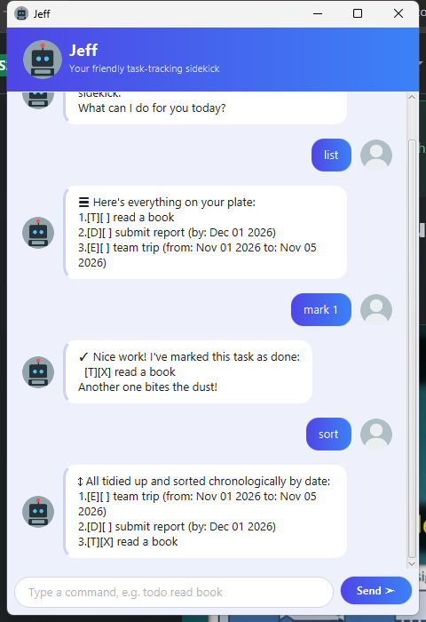

# Jeff User Guide



**Jeff** is a desktop chatbot for keeping track of your to-dos, deadlines, and events. It's built for
fast, typed-command use: if you can type, Jeff can manage your task list quicker than a traditional
point-and-click to-do app, while still being friendly enough to pick up in a minute — just type a
command into the text bar and press Enter (or click **Send**).

## Quick start

1. Make sure you have **Java 25** installed.
2. From the project directory, run:
   - `./gradlew runGui` to launch the chat-style GUI shown above, or
   - `./gradlew run` to use Jeff from the console instead.
3. Type a command (e.g. `todo read book`) and press Enter. Jeff replies right away, and your tasks are
   saved automatically — see [Saving your data](#saving-your-data).

## Features

> **Notes on the command format**
> - Words in `UPPER_CASE` are placeholders you fill in, e.g. in `todo DESCRIPTION`, `DESCRIPTION` could
>   be `todo read book`.
> - `INDEX` always refers to a task's number as shown by the most recent `list`, `find`, or `sort`.
> - Every `DATE` must be in `yyyy-mm-dd` format, e.g. `2019-12-02`.
> - A task's `DESCRIPTION` can't contain the `|` character (it's used internally to save your tasks to
>   disk).

### Adding a to-do: `todo`

Adds a task with no date attached — for anything that just needs doing, eventually.

Format: `todo DESCRIPTION`

Example: `todo read book`

```
✚ Got it! I've added this task:
  [T][ ] read book
You now have 1 tasks in the list. Let's keep the momentum going!
```

### Adding a deadline: `deadline`

Adds a task that needs to be done by a specific date.

Format: `deadline DESCRIPTION /by DATE`

Example: `deadline submit report /by 2019-12-02`

```
✚ Got it! I've added this task:
  [D][ ] submit report (by: Dec 02 2019)
You now have 2 tasks in the list. Let's keep the momentum going!
```

### Adding an event: `event`

Adds a task that starts and ends on specific dates. The `/from` date can't be after the `/to` date.

Format: `event DESCRIPTION /from DATE /to DATE`

Example: `event team trip /from 2019-11-01 /to 2019-11-05`

```
✚ Got it! I've added this task:
  [E][ ] team trip (from: Nov 01 2019 to: Nov 05 2019)
You now have 3 tasks in the list. Let's keep the momentum going!
```

### Listing all tasks: `list`

Shows every task currently on your list, numbered in the order they were added (or last sorted).

Format: `list`

```
☰ Here's everything on your plate:
1.[T][ ] read book
2.[D][ ] submit report (by: Dec 02 2019)
3.[E][ ] team trip (from: Nov 01 2019 to: Nov 05 2019)
```

### Marking a task as done: `mark`

Format: `mark INDEX`

Example: `mark 1` marks the 1st task in the list as done.

```
✓ Nice work! I've marked this task as done:
  [T][X] read book
Another one bites the dust!
```

### Marking a task as not done: `unmark`

Format: `unmark INDEX`

Example: `unmark 1` marks the 1st task in the list as not done.

```
↺ No worries! I've marked this task as not done yet:
  [T][ ] read book
You'll get to it!
```

### Deleting a task: `delete`

Format: `delete INDEX`

Example: `delete 2` removes the 2nd task in the list.

```
✖ Done! I've removed this task:
  [D][ ] submit report (by: Dec 02 2019)
You now have 2 tasks in the list. One less thing to worry about!
```

### Finding tasks: `find`

Finds every task whose description contains the given keyword. Matching is case-sensitive and looks
for the keyword anywhere in the description (not just whole words).

Format: `find KEYWORD`

Example: `find book`

```
★ Here's what I dug up for you:
1.[T][ ] read book
```

### Sorting tasks chronologically: `sort`

Reorders your list so deadlines and events come first, earliest date first. Todos (which have no date)
keep their original relative order and are placed after every dated task.

Format: `sort`

```
↕ All tidied up and sorted chronologically by date:
1.[E][ ] team trip (from: Nov 01 2019 to: Nov 05 2019)
2.[D][ ] submit report (by: Dec 02 2019)
3.[T][ ] read book
```

### Exiting Jeff: `bye`

Format: `bye`

Saves nothing extra (your data is already saved after every change) and closes the GUI window; the
console version exits the program.

## Saving your data

Jeff saves your task list to disk automatically after every command that changes it — adding, marking,
unmarking, deleting, or sorting. There's no separate save command, and nothing to confirm before
exiting. Your data is stored in `data/jeff.txt`, in the same folder you launch Jeff from, and is
reloaded automatically the next time you start Jeff.

## Errors

If a command can't be understood or completed — an unknown command, a missing or out-of-range task
number, a badly formatted date, and so on — Jeff explains what went wrong in a reply starting with
`OOPS!!!`. In the GUI, these replies are shown in a red-bordered bubble so they're easy to spot at a
glance; ordinary replies stay in a plain white or blue bubble.

## Command summary

| Action | Format | Example |
|---|---|---|
| Add a to-do | `todo DESCRIPTION` | `todo read book` |
| Add a deadline | `deadline DESCRIPTION /by DATE` | `deadline submit report /by 2019-12-02` |
| Add an event | `event DESCRIPTION /from DATE /to DATE` | `event team trip /from 2019-11-01 /to 2019-11-05` |
| List all tasks | `list` | `list` |
| Mark a task done | `mark INDEX` | `mark 1` |
| Mark a task not done | `unmark INDEX` | `unmark 1` |
| Delete a task | `delete INDEX` | `delete 2` |
| Find tasks | `find KEYWORD` | `find book` |
| Sort tasks chronologically | `sort` | `sort` |
| Exit Jeff | `bye` | `bye` |
